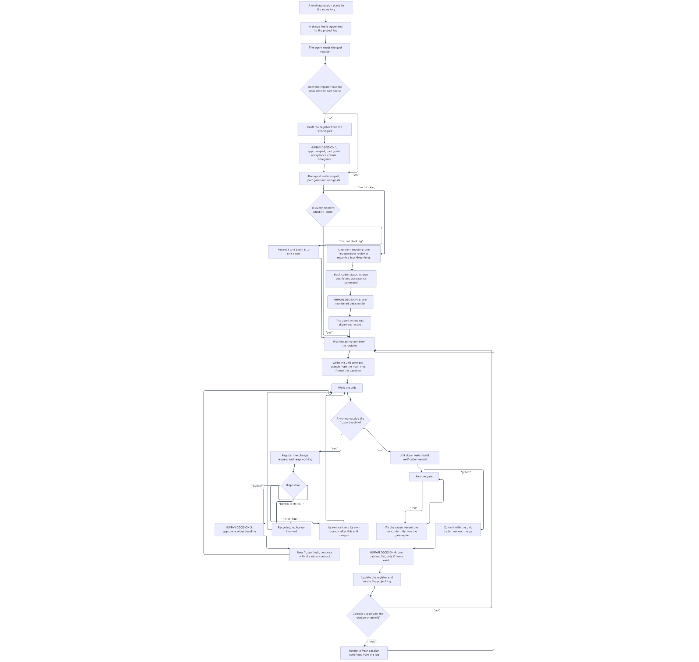
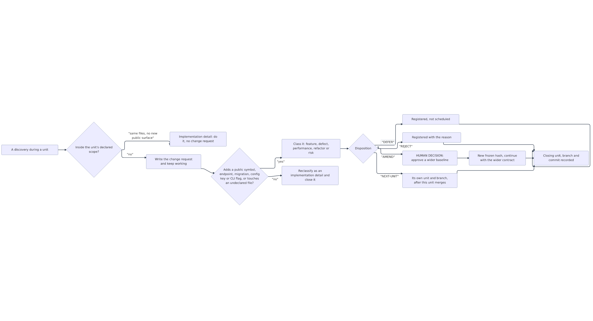
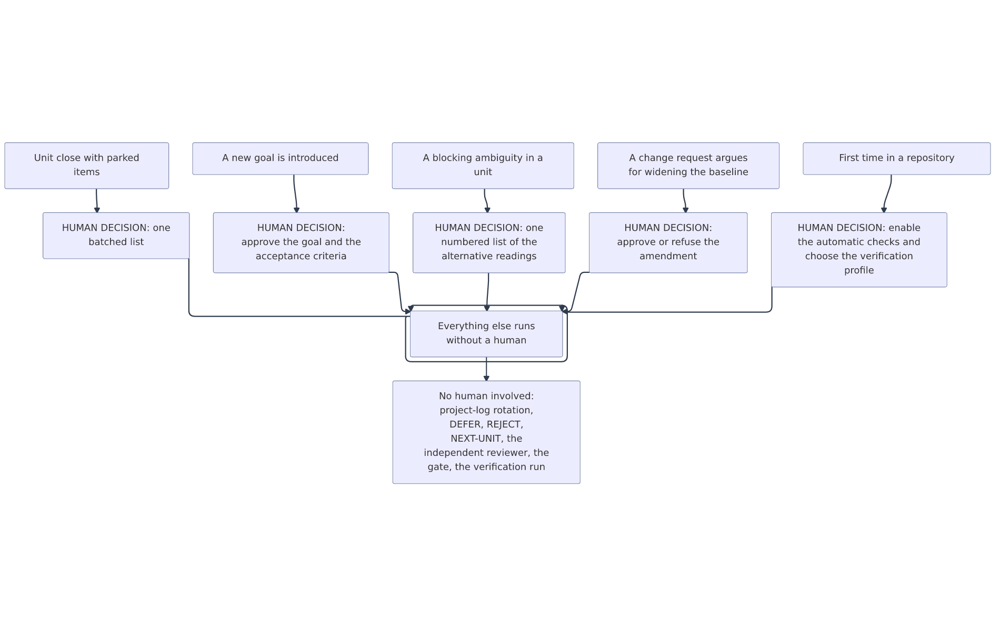

# Flödet i detalj (svenska)

Detta är den stegvisa beskrivningen av metoden. Den är verktygsneutral: "verktyget"
är den agent som utför arbetet, "grinden" är `scripts/pm-gate.sh`, och posterna är
vanliga filer under `.pm/`.

- `diagrams/flow-lifecycle.png` — hela loopen från sessionens start till nästa session.
- `diagrams/flow-change-control.png` — en upptäckt mitt i en enhet och var den tar vägen.
- `diagrams/flow-decisions.png` — de fem tillfällen där en människa behövs, och allt som sker utan.

Källkoden till varje bild ligger i `.mmd`-filen bredvid bilden.

## 1. Huvudflödet

| Steg | Vad som händer | Vem | Mekanism | Människa | Felmod och skydd |
| --- | --- | --- | --- | --- | --- |
| 1 | En arbetssession startas i repot | människa | valfritt agentverktyg, startat i projektroten | nej | startas det någon annanstans hittar lägesraden inget register |
| 2 | Lägesraden skrivs i projektloggen | verktyget | startkrok eller ett skript som lägger till en rad | nej | är mappen inte ett git-repo: larma tydligt i stället för att fortsätta tyst |
| 3 | Målregistret läses | agent | `.pm/GOALS.md` | nej | saknas registret skapas det först, se steg 4 |
| 4 | Målet och delmålen skrivs ned och godkänns | agent och människa | registerfil plus en fråga med numrerade alternativ | ja, en gång per nytt mål | inget startar utan godkännande |
| 5 | Mål, delmål och icke-mål återges | agent | varje del märks UNDERSTOOD, UNCLEAR eller CONFLICT | nej | en omärkt del får inte passera |
| 6 | En blockerande oklarhet avgörs | agent, granskare, utvecklare, människa | en oberoende granskare som svarar i fyra fasta fält, varje utvecklare anger sitt mål-id och sitt acceptanskommando, en numrerad fråga | ja, när den blockerar | icke-blockerande oklarhet antecknas och samlas till enhetens avslut |
| 7 | Enhetskontrakt, gren och fryst baslinje | agent | egen gren från huvudlinjen, hash av acceptanskriterierna i första incheckningens trailer | nej | en hash som bara ligger bredvid texten den skyddar är självintygad |
| 8 | Enheten arbetas igenom | utvecklare | vanliga regler för bygge, tester och verifiering | nej | varje utvecklare skriver sin egen bekräftelserad, grinden kontrollerar texten |
| 9 | Något utanför baslinjen hittas | vem som helst | ändringsbegäran registreras, arbetet fortsätter | bara vid utökning | att smyga in ändringen i acceptanskriterierna är huvudrisken |
| 10 | Enhetens verifiering | agent och granskare | tester, bygge, oberoende verifieringsbevis | nej | verifieringen måste vara färsk mot det pushade läget |
| 11 | Grinden körs | agent eller krok | `scripts/pm-gate.sh` | nej | en röd grind är en registrerad avvikelse, inte en tyst omkörning |
| 12 | Incheckning, granskning, sammanfogning | agent och människa | en incheckning med enhetens trailer | granskning som vanligt | aldrig direkt på huvudlinjen |
| 13 | En samlad beslutslista | agent och människa | numrerade alternativ i en enda fråga | bara om poster finns | fråga en gång, inte per post |
| 14 | Registret uppdateras och loggen roteras | agent | vanliga filskrivningar | nej | två skrivare glider isär, grinden jämför aktivt enhets-id |
| 15 | Kontext kontrolleras och loopen fortsätter | agent | förbrukning läst från verktyget om det visar den | nej | stanna inte ett flerenhetsprojekt långt under rotationsgränsen |

## 2. En upptäckt mitt i en enhet

En upptäckt är en implementationsdetalj bara om alla dessa villkor håller: varje fil
den rör ligger redan i enhetens diff, den lägger inte till någon ny publik symbol,
endpoint, migration, konfignyckel eller CLI-flagga, och den ändrar ingen befintlig
publik signatur. Allt annat är en ändringsbegäran.

| Disposition | Betydelse | Människa |
| --- | --- | --- |
| AMEND | Den frysta baslinjen vidgas, kräver ny hash och ett registrerat godkännande | ja, alltid |
| NEXT-UNIT | Egen enhet, egen gren från huvudlinjen, efter att den aktuella enheten sammanfogats | nej |
| DEFER | Verklig men inte schemalagd | nej |
| REJECT | Registrerad med skälet | nej |

När en ändringsbegäran stängs noteras enhets-id, gren och stängningsincheckning, så
att kedjan ändring till enhet till gren till incheckningar till verifieringsbevis
går att läsa ut ur git utan extra verktyg.

## 3. De fem mänskliga besluten

| Beslut | När | Vad som frågas | Standard om ingen svarar |
| --- | --- | --- | --- |
| Godkänn målet | ett nytt mål introduceras | mål, delmål, acceptanskriterier, icke-mål | inget startar, utkastet väntar |
| Blockerande oklarhet | en enhet kan inte formuleras entydigt | numrerad lista över alternativa tolkningar | enheten startar inte, frågan står kvar som öppen |
| Utökning av baslinjen | en ändringsbegäran vill vidga planen | vidga eller inte | behandlas som framtida enhet, arbetet fortsätter |
| Samlad lista | enhetens avslut, bara om poster finns | parkerade ändringar, accepterade risker, öppna frågor | skrivs som öppna i projektloggen |
| Projektaktivering | första gången i ett repo | slå på de automatiska kontrollerna och välj verifieringsprofil | de automatiska grindarna förblir inaktiva |

## 4. Kostnad och granskningslast

| Post | Kostnad | Natur |
| --- | --- | --- |
| Commit-grinden | 5 till 15 ms per matchande kommando | uppskattning, håll skriptet snabbt eftersom krok-timeouter fail-open |
| Grindskriptet | under 200 ms per körning | uppskattning |
| Oberoende granskare | en barntur, 5 till 15 s | mätning från verkliga körningar |
| Utvecklarnas bekräftelserader | inga extra anrop, sker i deras egen tur | mätning |
| Mänskliga turer | 1,5 till 2 per enhet | uppskattning: en för oväntad utökning eller röd grind, en vid avslut |

## 5. Felmoder och skydd

| Felmod | Varför | Skydd |
| --- | --- | --- |
| Spärren finns inte | krokar fail-open och repolokala krokar kan kräva ett uttryckligt förtroende | montera spärren där den alltid är aktiv, låt den göra ingenting när registret saknas, och kalla den ärligt en driftsspärr |
| Grinden ser inte in i planen | semantisk omfattningsökning är osynlig för ett skript | enhetens slutdiff är detektorn, risken skrivs ned som accepterad |
| En leverantör slutar svara | en modell-slug kan fallera för alla samtidigt | pinna aldrig en modell i reglerna eller i en rolldefinition |
| Svag modell fastnar i loop | ett nekande utan väg vidare | varje nekande ska vara åtgärdbart, plus en dokumenterad bypass med registrerat skäl |
| Två dokument glider isär | två poster, två skrivare | grinden kontrollerar att båda pekar på samma aktiva enhet |
| Sessioner krockar | delade registerfiler | en fil per enhet och per ändringsbegäran |

## 6. Införande och återställning

1. Endast poster och grindskript, ingen automation.
2. Automatisk lägesrad vid sessionens start.
3. Pilot: kör grinden retroaktivt över de senaste avslutade enheterna i två repon och
   mät vad den hade fångat.
4. Bredda först där mätningen visar verklig drift och inte formalia.

Återställning är billig genom konstruktionen: posterna är vanliga filer, grinden är
overksam när den inte är monterad, och hela metoden kan dras tillbaka utan att röra
produktkod.
